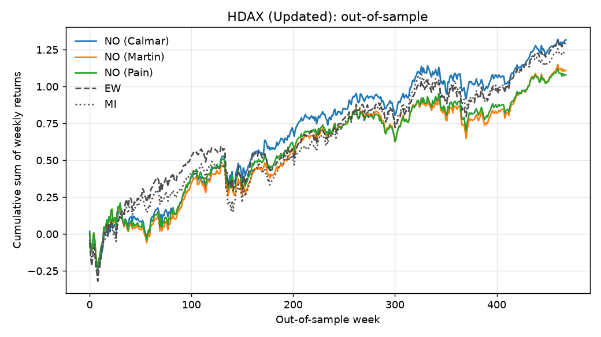

# Portfolio Optimisation and Market Index Tracking

Long-only portfolios that maximise a drawdown-based ratio (Calmar, Martin, Pain),
refitted weekly and tested out of sample against equal weights and the market index.

## Context

- Python adaptation of my BSc Computer Science Final Year Project (22CS040)
- City University of Hong Kong, 2022-23, supervised by Prof. Jun Wang
- Original in MATLAB (2023), rewritten in Python (2026)
- Report and slides: [`docs/`](docs/)
- My work: convex reformulations of the ratio problems, solver setup, backtests
- "NO" (neurodynamic optimisation) is the report's name for the optimised portfolio;
  the formulations follow Wang and Gan (2023), and both versions solve them with LP / SQP
- Scope here: Calmar, Martin and Pain vs EW and MI (Conditional Pain not included)

## Problem

- Weights $x \ge 0$, $\sum x = 1$; weekly returns $r_t$; mean return $\mu$; risk-free rate $r_f$
- Drawdown on the cumulative return path:

```math
P_j = \sum_{i \le j} r_i^\top x, \qquad d_j = \max_{i \le j} P_i - P_j
```

- Maximise $(\mu - r_f)^\top x \,/\, \rho(x)$ with

| Ratio | Risk measure $\rho$ |
|---|---|
| Calmar | max drawdown |
| Pain | average drawdown |
| Martin | Ulcer index (root mean squared drawdown) |

## Formulation

- Substitute $y = \eta x$ (Schaible 1974) to make the ratio problem convex
- $\xi_j$ = running peak of the portfolio path

```math
\begin{aligned}
\max\quad & \mu^\top y - r_f\,\eta \\
\text{s.t.}\quad & \textstyle\sum y = \eta,\ \ y \ge 0,\ \ \xi \ge 0,\ \ \xi_j \ge \xi_{j-1},\ \ \xi_j \ge R_j^\top y \quad (R_j = r_1 + \dots + r_j) \\
\text{Calmar:}\quad & \xi_j - R_j^\top y \le 1 \ \text{ for all } j \\
\text{Pain:}\quad & \tfrac{1}{m}\textstyle\sum_j (\xi_j - R_j^\top y) \le 1 \\
\text{Martin:}\quad & \tfrac{1}{m}\textstyle\sum_j (\xi_j - R_j^\top y)^2 \le 1
\end{aligned}
```

- Weights: $x = y / \eta$
- Calmar and Pain: linear programs; Martin: one convex quadratic constraint

## Solver

- Calmar, Pain: `scipy.optimize.linprog` (HiGHS)
- Martin: SLSQP (`scipy.optimize.minimize`), analytic gradients, FYP starting point
- Check: all three also solved with cvxpy (convex, so cvxpy gives the global optimum)

## Backtest

- 50/50 split: first half in-sample, second half out-of-sample
- Refit every week on all earlier weeks, hold for one week (no look-ahead)
- No-trade rule: hold cash if every asset's mean return is below $r_f$
- Ex-post ratio: mean weekly excess return / risk measure, times $\sqrt{\text{weeks per year}}$
- Benchmarks: EW (equal weights) and MI (market index)

## Data

| Library | Dataset | Stocks | Weeks | Period |
|---|---|---:|---:|---|
| BCST (Bruni et al., 2016) | DJIA | 28 | 1363 | 1990 - 2016 |
| | NASDAQ100 | 82 | 596 | 2004 - 2016 |
| | FTSE100 | 83 | 717 | 2002 - 2016 |
| | S&P500 | 442 | 595 | 2004 - 2016 |
| Updated (Leung et al., 2022a) | HDAX | 49 | 938 | 2000 - 2017 |
| | FTSE100 | 56 | 938 | 2000 - 2017 |
| | HSCI | 77 | 938 | 2000 - 2017 |
| | S&P500 | 356 | 938 | 2000 - 2017 |

- CSV files in [`data/`](data/), with a weekly risk-free series per dataset
- BCST: weekly returns (last week dropped for an even split)
- Updated: weekly prices, converted to simple returns

## Results

Annualised ex-post ratios over the out-of-sample half. Best of NO / EW / MI in bold.

### Original results (MATLAB, 2023)

From Tables 2 and 3 of the report (NO, EW, MI columns only).

**Updated Library**

| Ratio | Dataset | NO | EW | MI |
|---|---|---:|---:|---:|
| Calmar | HDAX | **0.0766** | 0.0649 | 0.0549 |
| Calmar | FTSE100 | **0.1029** | 0.0927 | 0.0427 |
| Calmar | HSCI | **0.0978** | 0.0709 | 0.0314 |
| Calmar | S&P500 | 0.0827 | **0.0994** | 0.0691 |
| Martin | HDAX | **0.2721** | 0.2408 | 0.2073 |
| Martin | FTSE100 | **0.3706** | 0.3441 | 0.1497 |
| Martin | HSCI | 0.1873 | **0.2278** | 0.0936 |
| Martin | S&P500 | **0.0255** | 0.0187 | 0.0232 |
| Pain | HDAX | **0.4288** | 0.3764 | 0.3240 |
| Pain | FTSE100 | **0.5585** | 0.5189 | 0.2228 |
| Pain | HSCI | 0.2683 | **0.3335** | 0.1264 |
| Pain | S&P500 | 1.384 | **1.426** | 1.298 |

**BCST-Library**

| Ratio | Dataset | NO | EW | MI |
|---|---|---:|---:|---:|
| Calmar | DJIA | 0.0154 | **0.0248** | 0.0132 |
| Calmar | NASDAQ100 | **0.1939** | 0.1517 | 0.1391 |
| Calmar | FTSE100 | 0.0843 | 0.01230 [a] | 0.0434 |
| Calmar | S&P500 | **0.1297** | 0.0986 | 0.0910 |
| Martin | DJIA | 1.3900 | **1.4373** | 0.4183 |
| Martin | NASDAQ100 | 1.3894 | **1.5476** | 1.1642 |
| Martin | FTSE100 | **1.1374** | 0.8420 | 0.2126 |
| Martin | S&P500 | **0.0947** | 0.0901 | 0.0933 |
| Pain | DJIA | 0.2934 | **0.3078** | 0.1135 |
| Pain | NASDAQ100 | **1.1956** | 1.1576 | 0.8020 |
| Pain | FTSE100 | **0.7921** | 0.6494 | 0.1991 |
| Pain | S&P500 | **0.7907** | 0.7572 | 0.6733 |

[a] As printed in the report; likely a typo for 0.1230 (this code gives 0.1230).

### This implementation

From `scripts/run_experiments.py` ([`results/ex_post_ratios.csv`](results/ex_post_ratios.csv)).

**Updated Library**

| Ratio | Dataset | NO | EW | MI |
|---|---|---:|---:|---:|
| Calmar | HDAX | **0.0767** | 0.0649 | 0.0549 |
| Calmar | FTSE100 | **0.1029** | 0.0927 | 0.0427 |
| Calmar | HSCI | **0.0978** | 0.0709 | 0.0314 |
| Calmar | S&P500 | **0.2035** | 0.0994 | 0.0625 |
| Martin | HDAX | 0.1798 | **0.2408** | 0.2073 |
| Martin | FTSE100 | **0.3807** | 0.3441 | 0.1497 |
| Martin | HSCI | **0.4001** | 0.2278 | 0.0936 |
| Martin | S&P500 | 0.4792 | **0.6168** | 0.3705 |
| Pain | HDAX | 0.2577 | **0.3764** | 0.3241 |
| Pain | FTSE100 | **0.5385** | 0.5190 | 0.2229 |
| Pain | HSCI | **0.4922** | 0.3335 | 0.1265 |
| Pain | S&P500 | 0.8854 | **1.1623** | 0.6539 |

**BCST-Library**

| Ratio | Dataset | NO | EW | MI |
|---|---|---:|---:|---:|
| Calmar | DJIA | 0.0157 | **0.0248** | 0.0132 |
| Calmar | NASDAQ100 | **0.1940** | 0.1518 | 0.1391 |
| Calmar | FTSE100 | 0.0843 | **0.1230** | 0.0434 |
| Calmar | S&P500 | **0.1298** | 0.0986 | 0.0910 |
| Martin | DJIA | 0.0553 | **0.1484** | 0.0624 |
| Martin | NASDAQ100 | 0.5783 | **0.6691** | 0.5177 |
| Martin | FTSE100 | **0.4715** | 0.4215 | 0.1366 |
| Martin | S&P500 | **0.6447** | 0.4390 | 0.4020 |
| Pain | DJIA | 0.1050 | **0.3078** | 0.1135 |
| Pain | NASDAQ100 | 0.9708 | **1.1577** | 0.8021 |
| Pain | FTSE100 | **0.6819** | 0.6494 | 0.1991 |
| Pain | S&P500 | **0.8777** | 0.7573 | 0.6733 |

- NO best in 14 of 24 rows (Updated: 8 of 12; BCST: 6 of 12)
- Calmar NO best on 6 of 8 datasets; loses to EW on DJIA and BCST FTSE100
- EW is hard to beat on DJIA and NASDAQ100, in line with DeMiguel et al. (2009)



More plots (cumulative returns, weights) in [`results/figures/`](results/figures/).

### Why the two tables differ

- **Calmar:** same result on 7 of 8 datasets (within 0.0003)
  - Updated S&P500: my saved MATLAB weights give 0.2035, not the 0.0827 in the report
- **Martin and Pain (NO column):** not comparable
  - The MATLAB solver hit its limit of 4000 function calls
  - So it stopped early, close to equal weights
  - Here the solvers run to the true optimum (checked with cvxpy)
- **Martin scale:** this code uses the Ulcer index
  - Gives the same EW and MI values as the report for the Updated Library
  - The report's BCST Martin rows used mean squared drawdown instead, with some rows divided by 10 or 100
- **Updated S&P500 EW and MI:** some values differ; the original MATLAB runs for this dataset were not complete
- **DJIA Calmar NO:** 0.0157 vs 0.0154 from the same weights; cause unknown

## Validation

- **Calmar weights vs MATLAB:** same on all 8 datasets ([`results/weight_validation.csv`](results/weight_validation.csv))
  - Typical difference: below 0.000001
  - 3 of 3,510 weeks differ more (up to 0.035): weeks where more than one answer is optimal
- **Martin and Pain weights vs MATLAB:** different, as expected (see above)
- **Solvers vs cvxpy:** same optimum within 0.013% ([`results/solver_check.csv`](results/solver_check.csv))
- **EW and MI vs report:** same to about 4 decimals, apart from the cases above

## How to run

```bash
python -m venv .venv && source .venv/bin/activate
pip install -e ".[test]"

python scripts/run_experiments.py          # all datasets and ratios
python scripts/run_experiments.py --datasets HDAX --ratios calmar pain
python scripts/plot.py                     # figures in results/figures/
python scripts/check_solvers.py            # LP / SLSQP vs cvxpy
```

- Calmar and Pain: a few minutes in total
- Martin: minutes per dataset, 1-3 hours for the two S&P500 datasets
- Weekly weights cached in `results/weights/`

## Tests

```bash
pytest
```

- Drawdown measures and ratios on hand-computed examples
- Price-to-return conversion
- LP and SLSQP agree with cvxpy
- Weights non-negative and sum to 1 (or all zero on no-trade weeks)
- No-trade rule
- No look-ahead

## Limitations

- Drawdowns on the cumulative sum of returns, not compounded wealth (as in the FYP)
- $\sqrt{\text{weeks per year}}$ annualisation is a convention (as in the FYP)
- No transaction costs or cardinality constraints
- Updated S&P500 index has one fewer weekly price, so its MI uses one week less
- Other BCST baselines from the report (M-V, SSD, CZeSD) not reproduced

## References

- Bruni, R., Cesarone, F., Scozzari, A., and Tardella, F. (2016). Real-world datasets for portfolio selection and solutions of some stochastic dominance portfolio models. *Data in Brief*, 8, 858-862.
- DeMiguel, V., Garlappi, L., and Uppal, R. (2009). Optimal versus naive diversification: How inefficient is the 1/N portfolio strategy? *Review of Financial Studies*, 22(5), 1915-1953.
- Leung et al. (2022a). Source of the Updated Library datasets, as cited in Section 4.2 of the FYP report.
- Markowitz, H. (1952). Portfolio selection. *The Journal of Finance*, 7(1), 77-91.
- Schaible, S. (1974). Parameter-free convex equivalent and dual programs of fractional programming problems. *Zeitschrift fur Operations Research*, 18, 187-196.
- Wang, J., and Gan, X. (2023). Neurodynamics-driven portfolio optimization with targeted performance criteria. *Neural Networks*, 157, 404-421.
